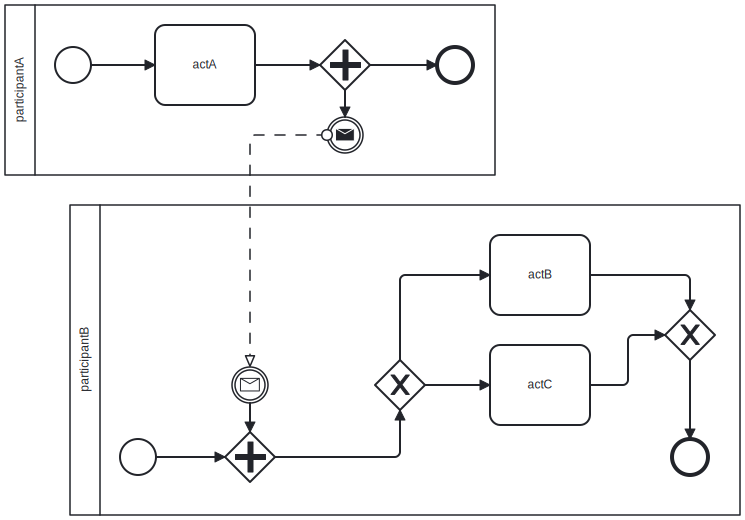
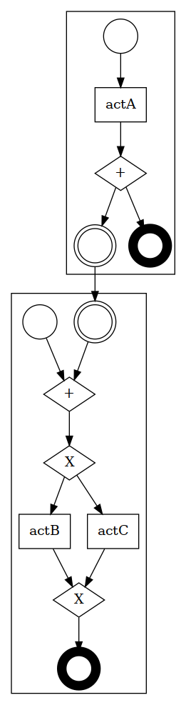
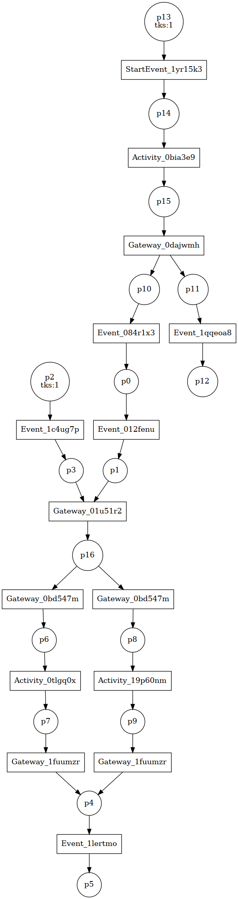

# BPMNCHECK

This micro library provides utilities to:
- define [BPMN](https://en.wikipedia.org/wiki/Business_Process_Model_and_Notation) diagrams
- parse such diagrams from ".bpmn" files
- generate Place/Transition [Petri Nets](https://en.wikipedia.org/wiki/Petri_net) from such diagrams

In turn these Petri Nets may be used to model check the Business Process Model.

## Example

The table below illustrates the generation of a Petri Net from an initial BPMN diagram.

| Initial BPMN diagram | Visualization of library's internal representation | Produced Petri Net, labelling with BPMN ids |
|---|---|---|
|  |  |   |
